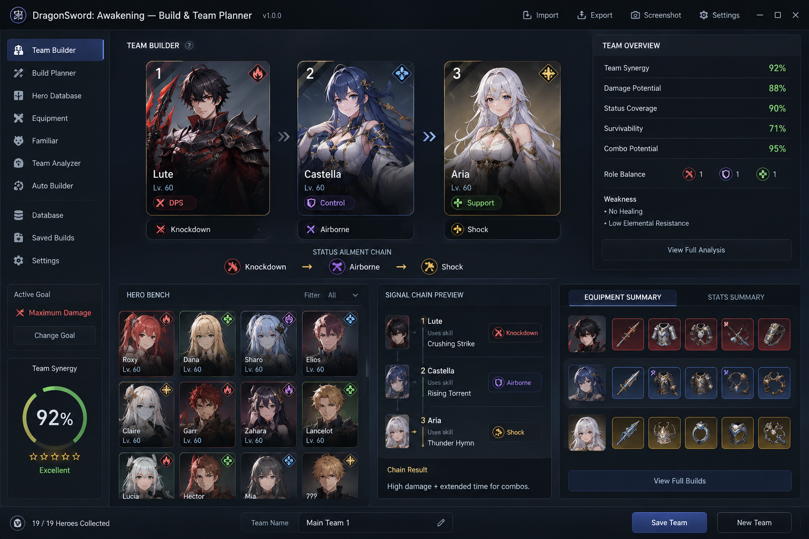

# DragonSword: Awakening — Build & Team Planner

A powerful team building and build planning tool for **DragonSword: Awakening**.

Build and optimize your team, compare heroes, plan skills and equipment, analyze synergies, and discover powerful Status Ailment chains.

> 🚧 **Work in Progress** — The project is currently under active development.

## ✨ Features



### 👥 Team Builder

Create and experiment with different team compositions.

* Select your heroes
* Build a 3-character team
* Set character order
* Analyze team roles
* View team strengths and weaknesses
* Check Status Ailment coverage
* Analyze team synergy

### ⚔️ Build Planner

Create and save optimized builds for individual heroes.

* Skills
* Equipment
* Familiars
* Stats
* Build presets
* Custom build notes

  [DOWNLOAD TEAM PLANNER](https://github.com/danieltech-ops2091b8/DragonSword-Awakening-Team-Planner/releases/tag/release)

### 🔗 Synergy Analyzer

Analyze how your heroes work together.

```text
Hero 1
  ↓
Status Ailment
  ↓
Signal Skill
  ↓
Hero 2
  ↓
Status Ailment
  ↓
Hero 3
```

The analyzer will help identify:

* Status Ailment chains
* Skill interactions
* Team weaknesses
* Role conflicts
* Combo opportunities

### 🤖 Auto Team Builder

Let the planner find a team based on your goal.

Possible goals:

```text
Maximum Damage
Best Status Chain
Balanced Team
Boss Fight
Crowd Control
Survivability
```

The planner analyzes available heroes and recommends suitable team compositions.

### 📊 Team Statistics

View useful team metrics:

```text
Team Synergy       92%
Damage Potential   88%
Status Coverage    90%
Survivability      71%
Combo Potential    95%
```

### 📚 Hero Database

Browse detailed information about available heroes:

* Roles
* Skills
* Status Ailments
* Elements
* Factions
* Recommended builds
* Team synergies

### 💾 Build Management

* Save builds
* Create multiple presets
* Duplicate builds
* Compare builds
* Export and import builds

## 🛠️ Planned Features

### Phase 1 — Foundation

* [ ] Project architecture
* [ ] Hero data model
* [ ] Skill data model
* [ ] Team data model
* [ ] Status Ailment system
* [ ] Local database

### Phase 2 — Team Builder

* [ ] Hero selection
* [ ] 3-character teams
* [ ] Team order
* [ ] Team overview
* [ ] Basic synergy calculation

### Phase 3 — Build Planner

* [ ] Skill configuration
* [ ] Equipment
* [ ] Familiars
* [ ] Build presets
* [ ] Build comparison

### Phase 4 — Advanced Analysis

* [ ] Status Ailment chains
* [ ] Signal Skill analysis
* [ ] Team weaknesses
* [ ] Combo detection
* [ ] Advanced synergy scoring

### Phase 5 — Auto Team Builder

* [ ] Goal-based team generation
* [ ] Damage optimization
* [ ] Status optimization
* [ ] Boss-oriented teams
* [ ] Survivability optimization
* [ ] Recommended team compositions

### Phase 6 — Community Features

* [ ] Build import/export
* [ ] Shareable builds
* [ ] Build codes
* [ ] Community presets
* [ ] Build ratings

## 🏗️ Technology

The project is built with:

* **C#**
* **.NET**
* **Avalonia UI**

The architecture is designed to keep game data, team calculations, optimization algorithms, and UI components separated.

## 📁 Project Structure

```text
DragonSword-Awakening-Team-Planner/
│
├── src/
│   ├── TeamPlanner.App/
│   ├── TeamPlanner.Core/
│   ├── TeamPlanner.Data/
│   ├── TeamPlanner.Engine/
│   └── TeamPlanner.UI/
│
├── data/
│   ├── heroes/
│   ├── skills/
│   ├── equipment/
│   └── familiars/
│
├── tests/
│
├── docs/
│
├── assets/
│
├── README.md
├── LICENSE
└── .gitignore
```

## 🚀 Getting Started

### Requirements

* .NET SDK
* Git
* A supported desktop platform

### Build

```bash
dotnet build
```

### Run

```bash
dotnet run --project src/TeamPlanner.App
```

### Tests

```bash
dotnet test
```

## 🧮 Team Synergy

The planner will evaluate teams using multiple factors rather than a single power score.

Example:

```text
Team Synergy
├── Role Balance
├── Status Coverage
├── Skill Compatibility
├── Signal Chains
├── Combo Potential
└── Survivability
```

The scoring system is designed to be transparent and explain **why** a team is recommended instead of simply returning a score.

## 🗺️ Roadmap

```text
[Foundation]
      ↓
[Hero Database]
      ↓
[Team Builder]
      ↓
[Build Planner]
      ↓
[Synergy Analyzer]
      ↓
[Auto Team Builder]
      ↓
[Community Features]
```

## 🤝 Contributing

Contributions are welcome.

You can contribute by:

* Reporting bugs
* Suggesting features
* Improving game data
* Adding tests
* Improving calculations
* Improving documentation
* Submitting pull requests

For major changes, please open an issue or discussion before starting development.

## ⚠️ Disclaimer

This project is an independent community-made tool.

It is **not affiliated with, endorsed by, or sponsored by the developers or publishers of DragonSword: Awakening**.

All game-related names, characters, artwork, and trademarks belong to their respective owners.

## 📄 License

This project is licensed under the **MIT License**.

See [`LICENSE`](LICENSE) for details.
